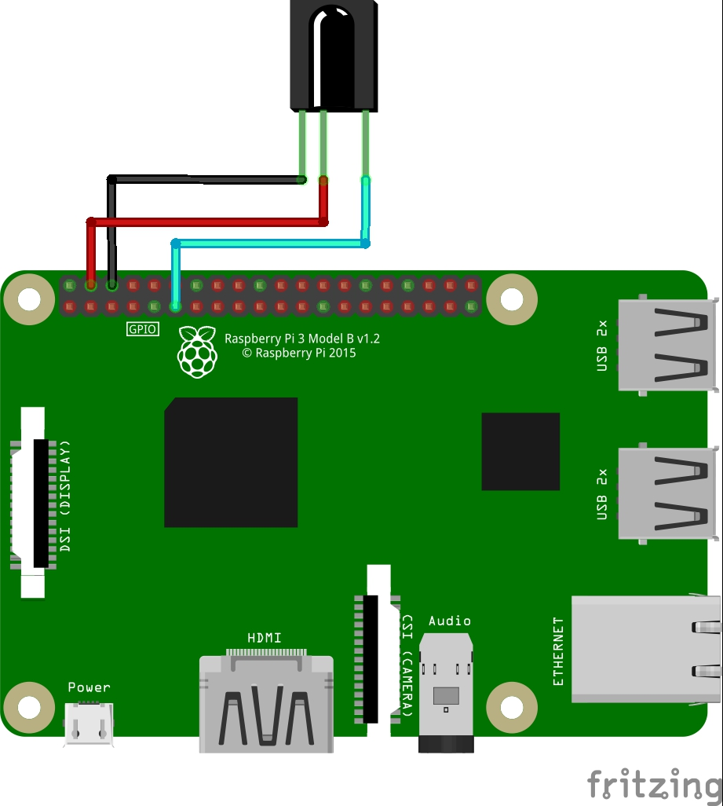

========================================
Guide to use the customizations/features
========================================

Enabling or Disabling Custom Actions
------------------------------------

Major custom actions have been provided with a control key or switch in the **config.yaml**.
Set it to **Enabled** to enable the custom actions and set it to **Disabled** to disable them.

Using Custom Actions in Non-English Languages
---------------------------------------------

1. Languages supported: French, Italian, Spanish, Dutch, German and Swedish.
2. In the **config.yaml** file, under the **Languages and Choice** option set your desired language.
3. Use the Translated versions of the English syntaxes given for all the custom actions.
4. You can change the keywords/trigger words for the custom actions in the keywords file.

Controlling Sonoff-Tasmota, Domoticz devices from Google Home
-------------------------------------------------------------

1. This has been implemented using Adafruit_IO.
2. Create an acount and a feed in adafruit.io website.
3. Enter those details in the config.yaml file.
4. Register or login into `IFTTT <http://www.ifttt.com/>`_ and create an applet to send commands from google assistant to adafruit_io feed.
5. For controlling domoticz and sonoff devices, the adafruit.io command should match the syntaxes for the respective custom actions.

Using the Interpreter Mode
--------------------------

.. note:: This uses GOOGLE CLOUD SPEECH API. Free usage is limited to `60MINS/MONTH <https://cloud.google.com/speech-to-text/pricing>`_.

1. Go to the projects `page <https://console.cloud.google.com/project>`_ on your Google Cloud Console.
2. Select your project from the list.
3. On the left top corner, click on the hamburger icon or three horizontal stacked lines.
4. From the **API and services** option, select library and in the search bar type **speech**, select **Cloud Speech API** and click on "ENABLE".
5. You will be prompted to create a billing account if you already have not created one. Follow the onscreen instructions to create a billing account and then Enable the API.
6. Create a service account and generate credentials.
7. Copy the downloaded the JSON key and place it /home/pi/ directory **DO NOT RENAME**.
8. Enter the path to the Key along with the key name Eg: /home/pi/xxxx.json  in the config.yaml file in the "Google_Cloud_Speech_Credentials_Path" field under "Speechtotext".
   You can use one key for Cloud Speech and Cloud Text to Speech, but should enter the same path seperately in config.yaml

**Command Syntax:**

To start the interpreter::

   Hey Google, Start __Your-Desired-Language__ interpreter.

To stop the interpreter::

   Hey Google, Stop interpreter.

Using Google Cloud Text to Speech
---------------------------------

.. note:: GOOGLE CLOUD TEXT TO SPEECH API has limited free access. Once the quota is exceeded, the program will automatically switch to gTTS.

1. Go to the projects `page <https://console.cloud.google.com/project>`_ on your Google Cloud Console.
2. Select your project from the list.
3. On the left top corner, click on the hamburger icon or three horizontal stacked lines.
4. "From the API and services" option, select library and in the search bar type text, select "Cloud Text-to-Speech API" and click on "ENABLE".
5. In the API window, click on "Credentials" and then on "+ Create Credential".
6. In the "Add credentials to your project" window, in step-1 under "Which API are you using?" drop down choose "Cloud Text-to-Speech API" and down below choose "No, I’m not using them". Then click on "What credentials do I need?"
7. In step-2 give your service account a name and on the right in the "Role" drop down choose Project-->Owner and under "Key Type" select "JSON" and click "Continue".
8. Copy the downloaded key and place it /home/pi/ directory DO NOT RENAME.
9. Enter the path to the Key along with the key name Eg: /home/pi/xxxx.json  in the config.yaml file in the **Google_Cloud_TTS_Credentials_Path** field.

.. note:: You can use one key for Cloud Speech and Cloud Text to Speech, but should enter the same path seperately in config.yaml

Adding Custom Search API and Generating API Key
-----------------------------------------------
1. Go to the projects `page <https://console.cloud.google.com/project>`_ on your Google Cloud Console.
2. Select your project from the list.
3. On the left top corner, click on the hamburger icon or three horizontal stacked lines.
4. Move your mouse pointer over **API and services** and choose **Credentials**.
5. Click on create credentials and select API Key and choose close. Make a note of the created API Key and enter it in the config.yaml script at the indicated location.
6. "From the API and services" option, select library and in the search bar type **search**, select **Custom Search API** API and click on "ENABLE".
7. In the API window, click on "All API Credentials" and in the drop down, make sure to have a tick (check mark) against the API Key that you just generated.

Adding YouTube Data API and Generating API Key
-----------------------------------------------
1. Go to the projects `page <https://console.cloud.google.com/project>`_ on your Google Cloud Console.
2. Select your project from the list.
3. On the left top corner, click on the hamburger icon or three horizontal stacked lines.
4. Move your mouse pointer over **API and services** and choose **Credentials**.
5. Click on create credentials and select API Key and choose close. Make a note of the created API Key and enter it in the config.yaml script at the indicated location.
6. "From the API and services" option, select library and in the search bar type **youtube**, select **YouTube Data API v3** API and click on "ENABLE".
7. In the API window, click on "All API Credentials" and in the drop down, make sure to have a tick (check mark) against the API Key that you just generated.

.. note:: If a custom action uses both Custom Search and YouTube API, you need to enable both the APIs but only one API KEY needs to be generated.

.. note:: The same API key can be used for all the associated custom actions.

Controlling Assistant or Sending Preset Commands Using IR Remote
------------------------------------------------------

1. Connect the IR Receiver according to the wiring diagram given below.

.. note:: The diagram given is for GPIO 17, if you are using another GPIO, please make the suitable changes to the connection.

2. Run the sample IR receiver script to get the codes for your desired buttons::

      python /home/${USER}/GassistPi/Extras/IR-Sensor.py

3. In the config.yaml under IR, list your codes and corresponding queries/actions. The number of queries should match the number of codes listed.

4. If you want to execute the custom actions like Spotify, YouTube playback, Domoticz Control etc, prefix the word custom.

   Eg::

       custom Play God's Plan from Youtube
       custom Turn On _Domoticz-device-name__
       custom Play all the songs from Google Music

5. If you are sending a command to be processed by google assistant, there is no need to prefix custom.

   Eg::

       what is the time
       what can you do for me

 **Video for reference:**

   .. raw:: html

       

       <iframe width="100%" height="350" src="https://www.youtube.com/embed/LlbcjkRuQZk?rel=0" frameborder="0" allow="autoplay; encrypted-media" allowfullscreen></iframe>
       

Sending Commands or Queries to Google Assistant Over MQTT
------------------------------------------------------

1. Set up your desired MQTT broker.
   If you are setting up Raspberry Pi as a MQTT broker, follow the guide below.

   .. raw:: html

       

       <iframe width="100%" height="350" src="https://www.youtube.com/embed/Ce2Djxx9shU?rel=0" frameborder="0" allow="autoplay; encrypted-media" allowfullscreen></iframe>
       

2. Enter the MQTT broker credentials and subscription topic in the provided config.yaml file.
3. Set the **MQTT_Control** to **Enabled**.
4. Now, you can send queries or commands to google assistant over MQTT.
5. If you are sending a command for custom actions, prefix custom in the payload.

   Eg::

       custom Play God's Plan from Youtube
       custom Turn On __Domoticz-device-name__
       custom Play all the songs from Google Music

6. If you are sending a command to be processed by google assistant, there is no need to prefix custom.

   Eg::

       what is the time
       what can you do for me

7. To turn on/off microphone just send the simple command mute.

   Eg::

       mute

  **For more details on the how to use this feature, refer to the video below:**

  .. raw:: html

      

      <iframe width="100%" height="350" src="https://www.youtube.com/embed/oemsmrdhNP8?rel=0" frameborder="0" allow="autoplay; encrypted-media" allowfullscreen></iframe>
      

Streaming Music from Deezer
---------------------------

.. note::
 - As a roundabout approach, I have programmed the assistant to get the playlist details using Deezer API and then fetch those tracks from YouTube.
 - This feature uses a YouTube Data API v3.
 - Click `here <https://gassistpi-documentation.readthedocs.io/en/latest/customization.html#adding-youtube-data-api-and-generating-api-key>`_ for guidelines to add YouTube Data API to the project and to generate the required key.

1. Add your Deezer user number in the config.yaml under the **Deezer:** and **User_id**.

2. In the config.yaml, under **Google_cloud_api_key:** replace **ENTER-YOUR-GOOGLE-CLOUD-API-KEY-HERE** with the key from Google Cloud Console.

**Command Syntax:**

To play the playlists added to your Deezer account::

      Hey Google, Play playlist __playlist-number__ from Deezer.

Example::

      Hey Google, Play __playlist 1__ from Deezer

Streaming Music from Gaana.com
------------------------------

.. note::
 - As a roundabout approach, I have programmed the assistant to get the playlist details using Deezer API and then fetch those tracks from YouTube.
 - This feature uses both YouTube Data API v3 and Custom Search API.
 - Click `here <https://gassistpi-documentation.readthedocs.io/en/latest/customization.html#adding-youtube-data-api-and-generating-api-key>`_ for guidelines to add YouTube Data API to the project and to generate the required key.
 - Click `here <https://gassistpi-documentation.readthedocs.io/en/latest/customization.html#adding-custom-search-api-and-generating-api-key>`_ for guidelines to add Custom Search API to the project and to generate the required key.

1. Add your playlists in the config.yaml under **Gaana: and Playlists:**.
2. In the config.yaml, under **Google_cloud_api_key:** replace **ENTER-YOUR-GOOGLE-CLOUD-API-KEY-HERE** with the key from Google Cloud Console.

**Command Syntax:**

1. To play the playlists added in config.yaml file::

      Hey Google, Play playlist __playlist-number__ from Gaana.com

   Example::

      Hey Google, Play __playlist 1__ from Gaana.com

2. To play other playlists::

      Hey Google, Play __user-playlist-query__ from Gaana.com

    Example::

      Hey Google, Play __Bollywood top 50__ from Gaana.com

Controlling Domoticz Devices
----------------------------

.. note:: As of today, you can control lights and switches only, more controls will be added in the future.

1. In the config.yaml file under **Domoticz:** change **Domoticz_Control:** from **Disabled** to **Enabled**.
2. List the device names and the ids that you want to control in the config.yaml file.
   The names should be the same as the ones in the domoticz server.

**Command Syntax:**

1. To On/Off/Toggle::

      Hey Google, Turn On/Turn Off/Toggle  __Name of your light__

   Example::

      Hey Google, Turn On __Bedroom Lamp__

2. To Change Brightness (between 0 and 100)::

      Hey Google, Set  __Name of your light__ brightness to __desired value__

   Example::

      Hey Google, Set __Bedroom lamp__ brightness to __5__

3. To Change  Colour (refer to the `list of available colors <https://gassistpi-documentation.readthedocs.io/en/latest/colorlist.html#list-of-available-colors-for-home-automation-projects>`_)::

      Hey Google, Set  _Name of your light_ color to __desired color__
      Hey Google, Change  __Name of your light__ to __desired color__ color

   Example::

      Hey Google, Set __Bedroom lamp__ color to __red__
      Hey Google, Change __Bedroom lamp__ to __red__ color

Custom Conversations
----------------------------

1. Customize the assistant's reply to a specific question.
2. Add the list of questions and answers in config.yaml under the **Conversation**: option.
3. **There must be only one question, but corresponding answers can be as many**.
4. Sample questions and answers has been provided, please follow the same pattern.

Custom Wakeword Activation
----------------------------

1. You can choose to either Enable or Disable the custom wakeword activation in the config.yaml file.
2. In the config.yaml file, under Wakewords, change the **"Custom_Wakeword"** to **'Enabled'** if you want to use the custom wakeword or set it to 'Disabled' if you dont want to use the custom wakeword option.
3. You have a choice between Snowboy and Picovoice for the custom wakeword engine.
4. For Snowboy, change **"Wakeword_Engine"** to **Snowboy** and for Picovoice, change **"Wakeword_Engine"** to **Picovoice**.
5. For changes to take effect, you need to restart the assistant. Changing status while an instance of assistant is already running will not cause any change.
6. Create your custom snowboy model `here <https://snowboy.kitt.ai>`_. Add the models to **/GassistPi/src/resources/snowboy_models** directory.
7. Sample Snowboy and Picovoice models have been provided and placed in the /GassistPi/src/resources/ folder. Set your desired models by setting their paths in the config.yaml file.
8. To disable the default **"Ok Google"** hotword, set the Ok_Google option to **"Disabled"**.

.. note:: If you turn off the default **Ok Google** wakeword/hotword, everytime you invoke the assistant using the custom wakeword, you will get a prompt for the Mic being turned Off and On.

9. Users using pushbutton.py or Pi Zero users have an option between using custom wakeword and GPIO trigerring. If custom wakeword is enabled, then GPIO trigger will not work. To enable GPIO triggering, set custom wakeword to 'Disabled'.

Playing Spotify Playlist
----------------------------

.. note::
 - Spotify API currently only supports playback in a web browser, but DRM content is being blocked in the Raspberry Pi.
 - As a roundabout approach, I have programmed the assistant to get the playlist details using Spotipy API and then fetch those tracks from YouTube. This custom program has a better accuracy than spotify playlist playback using mpsyt.
 - This feature uses a YouTube Data API v3.
 - Click `here <https://gassistpi-documentation.readthedocs.io/en/latest/customization.html#adding-youtube-data-api-and-generating-api-key>`_ for guidelines to add YouTube Data API to the project and to generate the required key.

1. Click `here <https://developer.spotify.com/dashboard/login>`_ and register for a spotify developer account, if you already don't have one.
2. In the developer's dashboard, choose **CREATE A CLIENT ID**. In the pop-up window provide the requested details.
3. Click on the new app created and copy the **CLIENT ID** and **CLIENT SECRET**. Paste it in the config.yaml file in the indicated space.
4. Access spotify `here <https://www.spotify.com/account/overview/>`_ and copy the username to be entered in config.yaml.

**Command Syntax:**

To play your playlist::

   Hey Google, Play __user-playlist-query__  from Spotify

Example::

   Hey Google, Play __Workout playlist__ from Spotify
   Hey Google, Play __Top Dance Numbers__ from Spotify

.. note:: If your playlist name does not have the word **playlist** do not use that in the query.

Tracking Kickstarter Campaigns
--------------------------------
A custom Google search engine for `Kickstarter <https://www.kickstarter.com/>`_ has been used. This requires an API to be added to your existing project.

Click `here <https://gassistpi-documentation.readthedocs.io/en/latest/customization.html#adding-custom-search-api-and-generating-api-key>`_ for guidelines to add Custom Search API to the project and to generate the required key.

**Command Syntax:**

To track a Kickstarter campaign::

   Hey Google, Track __your-desired-campaign__ Kickstarter campaign
   Hey Google, What is the status of __your-desired-campaign__ Kickstarter campaign

Example::

   Hey Google, Track __Mycroft 2__ Kickstarter campaign
   Hey Google, What is the status of __Mycroft 2__ Kickstarter campaign

Emulated Philips Hue Control
-----------------------------

1. Credits for the `Emulated Hue <https://github.com/diyhue/diyHue>`_ to `Marius Motea <https://github.com/mariusmotea>`_.
2. Follow the guidelines given in the `diyHue's documents <https://diyhue.readthedocs.io/en/latest/>`_ to setup the Emulated Hue Service.
3. Download sketches for your NodeMCU/Wemos/ESP Devices from `here <https://github.com/diyhue/Lights>`_.
4. If the Hue config file is not in the default location, change the path to the Hue config file in the following lines of main.py script.

   .. code-block:: python

     if os.path.isfile('/opt/hue-emulator/config.json'):
           with open('/opt/hue-emulator/config.json', 'r') as config

**Command Syntax:**

1. To turn On/Off lights::

     Hey Google, Turn __Hue-Light-Name__ On/Off

2. To change light color::

     Hey Google, Change __Hue-Light-Name__ colour to __Required-Colour__

3. To change brightness::

     Hey Google, Change __Hue-Light-Name brightness__ to __Required-Brightness-Level__

Sending Voice Messages from Pi to Phone/Tablet
----------------------------------------------

.. note::  For pushing voice messages, the GassistPi uses Pushbullet API.

1. Download and install pushbullet app on your tablet/mobile device.
2. Visit www.pushbullet.com register for new account or sign in with your existing account.
3. Choose Settings-->Account and then choose **Create access token**.
4. Copy this token and paste in config.yaml under **Pushbullet** and **Pushbullet_API_KEY**.

**Command Syntax:**

To send message::

   Hey Google, Send message

Send SMS via Clickatell
------------------------

1. Create a free account with clickatell.com.
2. Sign in to Clickatell SMS Platform.
3. Create sms integration.
4. Add your generated clickatell api number in config.yaml at the given point.

**Command Syntax:**

To send sms::

   Hey Google, Send clickatell message to __Person-name__

Get Recipe Messaged to Mobile/Tablet
--------------------------------------

.. note:: This feature uses the Pushbullet API for sending the recipes. Please first setup the Pushbullet feature as given here.

GassistPi uses `Edamam <https://www.edamam.com>`_ for getting recipe details/info. To use this feature:
  1. Click `here <https://developer.edamam.com/edamam-recipe-api>`_ to visit the developers' porta for Edamam.
  2. Signup as a developer/login with your existing account.
  3. In the Menubar at the top, Click on Dashboard-->Applications-->Create a new applicatiuon-->Recipe Search API and then create a new application.
  4. Copy the application id and application key and paste it in the actions.py script under the getrecipe function.

.. note:: While copying the application key, do not copy the "—"

**Command Syntax:**

To get recipes::

   Hey Google, Get ingredients for __Required-Item__

Control Magic Mirror by Voice
-----------------------------

1. You can control either Magic Mirror running on another Pi or Magic Mirror running on the same pi as GassistPi.
2. As a prerequisite, you should have the remote control module installed in the Pi running Magic Mirror.
3. Enter the Ip address of Pi running Magic Mirror in the config.yaml against the variable **mmmip** declared.

**Command Syntax:**

1. To show/hide weather module::

    Hey Google, Show/Hide Weather on Magic Mirror

2. To turn magic mirror display on/off::

    Hey Google, Turn Magic Mirror display on/off

3. To power off/reboot/restart Magic Mirror::

    Hey Google, Power off/Reboot/Restart Magic Mirror

Indicators for Google Assistant's Listening and Speaking Events
---------------------------------------------------------------

.. note::  Default GPIOs for the indicators are BCM GPIO05 and GPIO06. If you want to change the pins, change it in the config.yaml file.

Connect LEDs with colours of your choice to GPIO05 for Listening and GPIO06 for Speaking Events.

Pushbutton to Stop Music/Radio Playback and for Muting the Microphone
---------------------------------------------------------------------

.. note::  Default GPIO for the pushbutton is BCM GPIO23. If you want to change the pins, change it in the config.yaml file.

Connect a pushbutton between GPIO23 and Ground. Single press mutes microphone and double press stops music streaming.

Voice Control of GPIOs, Servo Motor and Safe Shutdown of Pi
-----------------------------------------------------------

.. note::
 - This feature uses a combination of two keywords to prevent false positives. These can be changed in the keywords.yaml file.
 - The default main keyword is **trigger**.
 - The default keyword for servo motor control is **servo**.
 - The default keyword for safe shutdown is **shutdown**.
 - Names for devices connected to the GPIOs should be assigned in the config.yaml file.

**Command Syntax:**

 1. To turn device connected to GPIO on/off::

     Hey Google, **Trigger** turn __Device-Name__ on/off

 2. To turn servo motor (example by 90 degrees)::

     Hey Google, **Trigger** **servo** 90

 3. To power off the Pi::

     Hey Google, **Trigger Shutdown**

**Check out the demo in the video below:**

    .. raw:: html

        

        <iframe width="100%" height="350" src="https://www.youtube.com/embed/-MmxWWgceCg?rel=0" frameborder="0" allow="autoplay; encrypted-media" allowfullscreen></iframe>
        

Voice Control of NodeMCU
--------------------------

NodeMCU control has been implemented in two ways:

    1. Control of NodeMCU running a webserver.
    2. Control of NodeMCU running Sonoff-Tasmota Firmware.

Controlling NodeMCU Running Webserver
~~~~~~~~~~~~~~~~~~~~~~~~~~~~~~~~~~~~~

1. Download the Arduino IDE code for Nodemcu from `here <https://github.com/shivasiddharth/iotwemos/blob/master/Google-Home-NodeMCU.ino>`_.
2. Add the wifi credentials, make the desired changes and upload the Arduino code onto the NodeMCU and get the IP address from the serial monitor.
3. Add the NodeMCU's IP address in the config.yaml under the **ESP** and **IP**.
4. Set device names in the config.yaml under **ESP** and **devicename**.
5. The default keyword for NodeMCU control is **Wireless**. You can change this in the keywords.yaml file.

**Command Syntax:**

To turn the device or ESP Pin on/off::

   Hey Google, **Wireless** turn __Device-Name__ on/off

Controlling NodeMCU Running Sonoff-Tasmota Firmware
~~~~~~~~~~~~~~~~~~~~~~~~~~~~~~~~~~~~~~~~~~~~~~~~~~~

1. Download the Tasmota firmware from this `link <https://mega.nz/#!Dwx0lDYL!CK_QYoR9GvBhqdEmVs98ac45TjTjPIQyeaezYT4jfE0>`_.

.. note:: This is an old firmware. You can upgrade to the latest firmware from this one.

2. Upload the firmware properly. You can use this video for reference.

   .. raw:: html

       

       <iframe width="100%" height="350" src="https://www.youtube.com/embed/ioONHaUOtFM?rel=0" frameborder="0" allow="autoplay; encrypted-media" allowfullscreen></iframe>
       
     

3. Set your Tasmota details in the under **Tasmota_devicelist** in config.yaml file.

**Command Syntax:**

To turn the Tasmota device on/off::

   Hey Google, Turn __Tasmota-Device-Name__ on/off

Casting YouTube Videos to Chromecast and Chromecast Control
-----------------------------------------------------------
.. note::
 - This feature uses a YouTube Data API v3. Click `here <https://gassistpi-documentation.readthedocs.io/en/latest/customization.html#adding-youtube-data-api-and-generating-api-key>`_ for guidelines to add YouTube Data API to the project and to generate the required key.
 - The default keyword is **Chromecast**. You can change that in the main.py script at  ``# if 'chromecast'.lower() in str(usrcmd).lower():``.
 - The IP address of Chromecast can be set in the actions.py file at:
    ``def chromecast_control(action):
       # Chromecast declarations
       # Do not rename/change "TV" its a variable
       TV = pychromecast.Chromecast("192.168.1.13") #Change ip to match the ip-address of your Chromecast``
 - Google has permitted the Chromecast control on its own. So this feature has been disabled. It can be enabled, if Google disables chromecast control in the future.

 **Command Syntax:**

1. To Play Video on Chromecast::

    Hey Google, Play __Desired-Video__ on Chromecast

2. To Stop Playback::

    Hey Google, Stop Chromecast

2. To Change volume::

    Hey Google, Chromecast Volume Up/Down

Controlling Media or Music Streaming by Voice
---------------------------------------------
